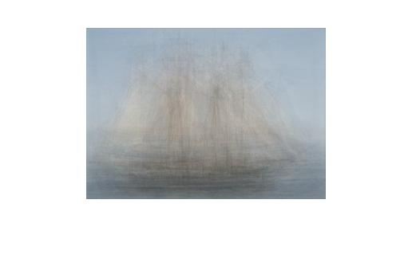
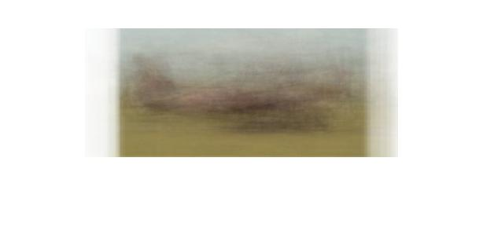

# CS116 Homework 1
**

## MATLAB Warmup [20 points]
Describe (in words where appropriate) the result of each of the following MATLAB commands. Use the help command as needed, but try to determine the output without entering the commands into MATLAB. Submit your description of the commands (not a screen-shot!)
### a.
``` matlab
>> a = [5:15]; % create a row vector filled in a specific range: [start:end],so it is filled from 5 to 15. will be [5 6 7 8 9 10 11 12 13 14 15]
>> b = a([1:3:end]); % start from a's 1st element, stepsize 3, till the end. it will create a row vector start from the first ele', skip every 2 ele' and get the 3rd ele'. So it will be [5 9 13]
```
### b.
``` matlab
>> f = [1501:2000]; % create a row vector filled from 1501 to 2000, inclusive.
>> g = find(f > 1850); % find indices of elements > 1850 in f
>> h = f(g); % Copies into h only the elemnts of f that are > 1850
```
### c.
``` matlab
>> x = 22.*ones(1,10); % ones(1,10) will create a 1 x 10 matrix filled with 1s. 22.*ones(1,10) will make a element-wise multiplication, so 22 will multiply every elements in ones(1,10). Thus, it will return a 1 x 10 matrix in which every element is 22.
>> y = sum(x); % Sum of the vector elments in x
```
### d.
``` matlab
>> a = [1:100]; % a is a row vector filled in range 1 to 100, inclusive.
>> b = a([end:-1:1]); % start from the end of a, stepsize -1, end at 1st of a. it will be a row vector filled from 100 to 1.
```
## Programming: average images
resulting images:
set1:
set2: 
Because every time when we go through a picture, we will add it to our running average, some common features of images will be 'highlighted' in the data. For example, the shape of the object is similar among a set of photos, so it can be preserved as we are adding data and finnally we can recognize it in the average image.
## Programming: color sensor demosaicing [40 points]
original raw image in grayscale:

demosaiced image: 


The correctly demosaiced image will appear darker than the JPG.  Why?
explaination:
Refer to the Figure 2.23 in Szeliski's book, which describe the image sensing pipline, there is a procedure called 'white balance' after demosaic step. Since we are missing this procedure, the image appear darker than the JPG. 