Jenny Zeng
52082740
zhaohuaz@uci.edu
# 1. gradient code
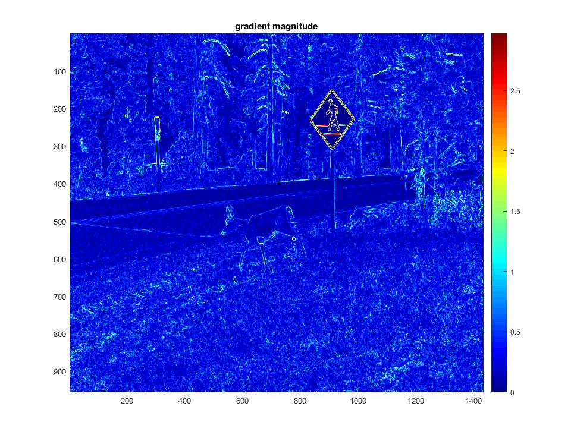
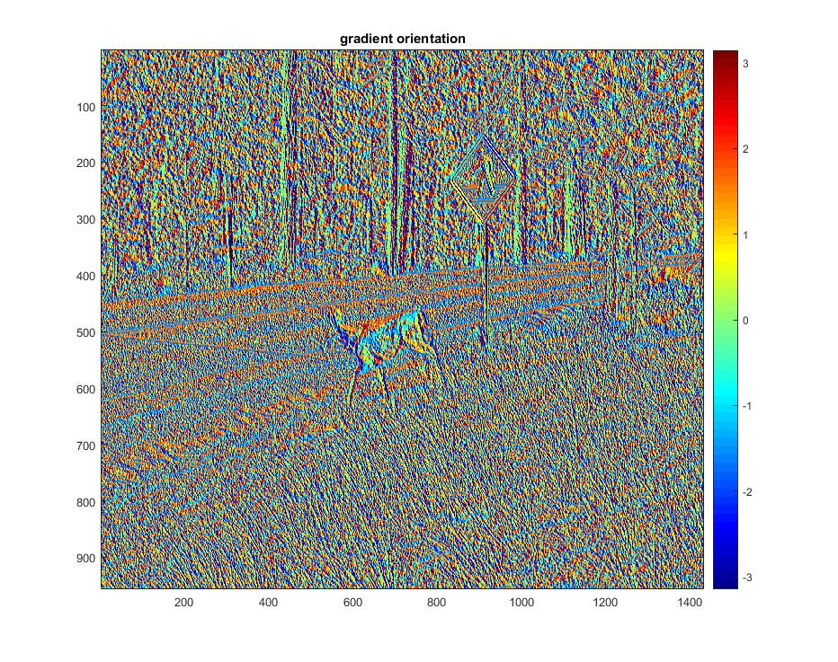

# 2. test detect code
## input1:
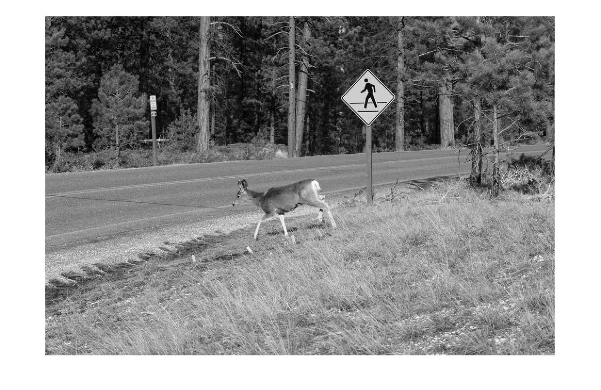

### result:
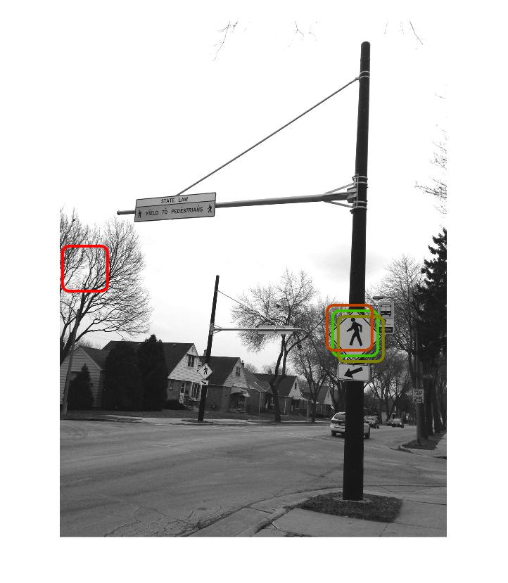
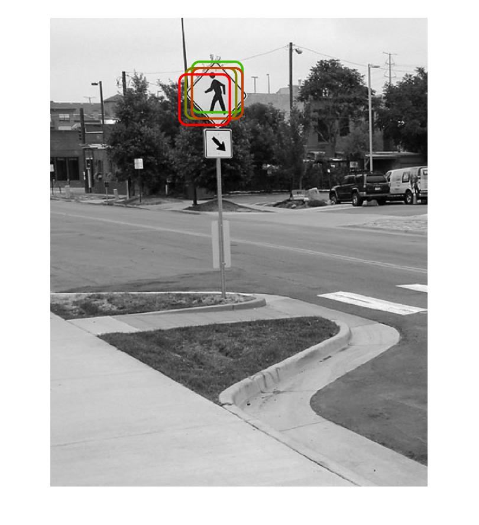
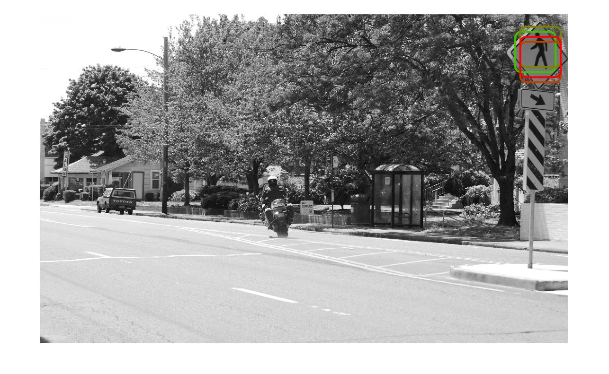
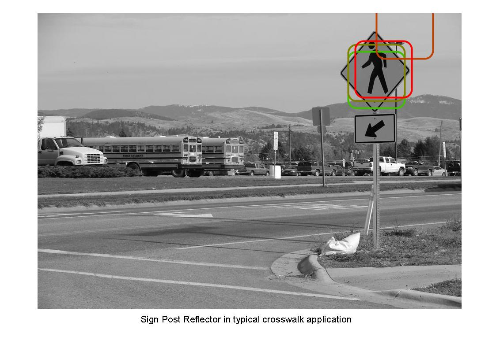
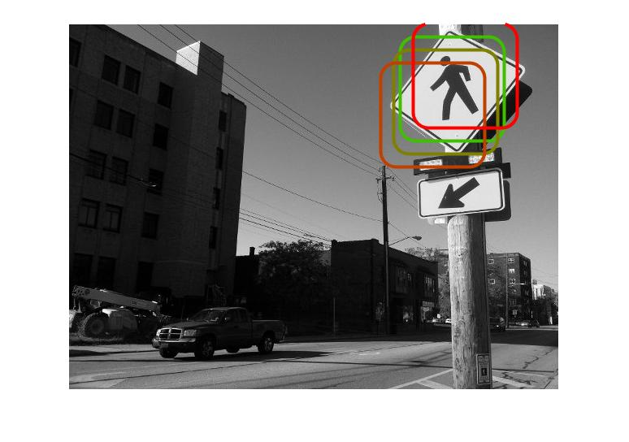

## input2:

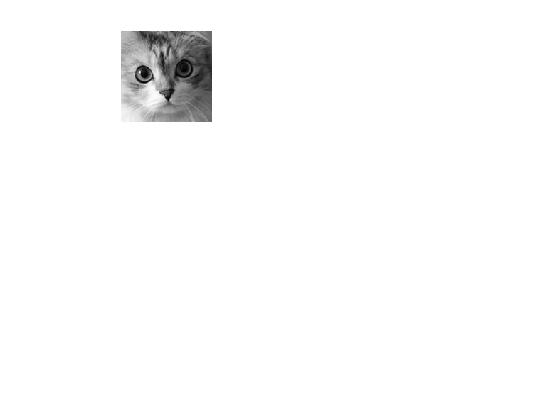
### result:
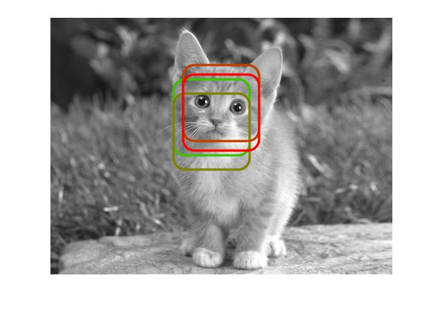
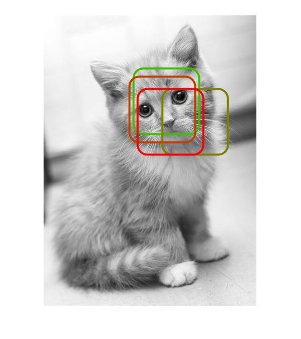
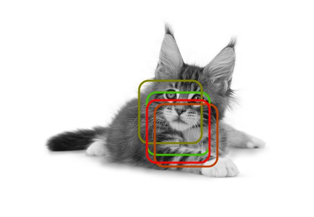

# 3. Discussion:
Just as what we discussed in the class, since an elephant can be rotated and the body shape may be different, it is hard to detect if the angle changes.
Also, because we get black and white images, we lost information in colors.

To get a better result, we can:
1. Use part Model: use a template to detect each part. 
2. use more images as input images and extract their features as average. (More samples for training)
